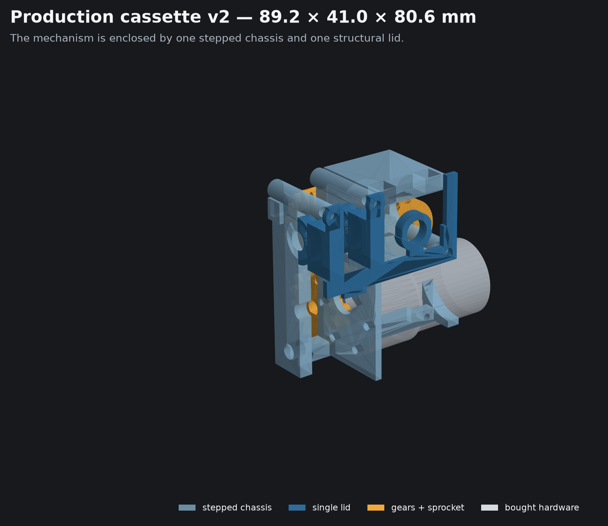
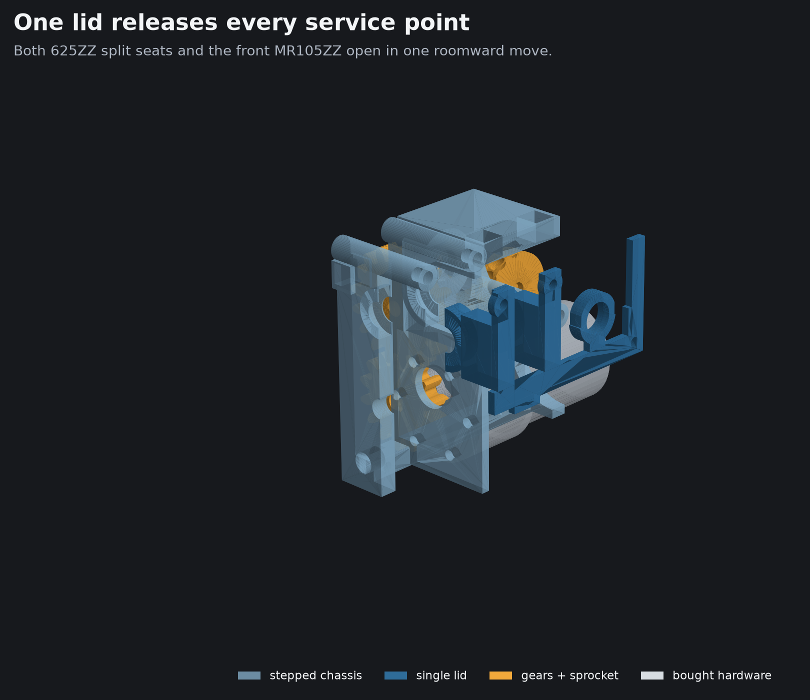
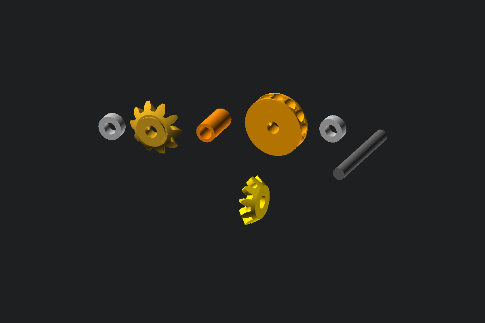
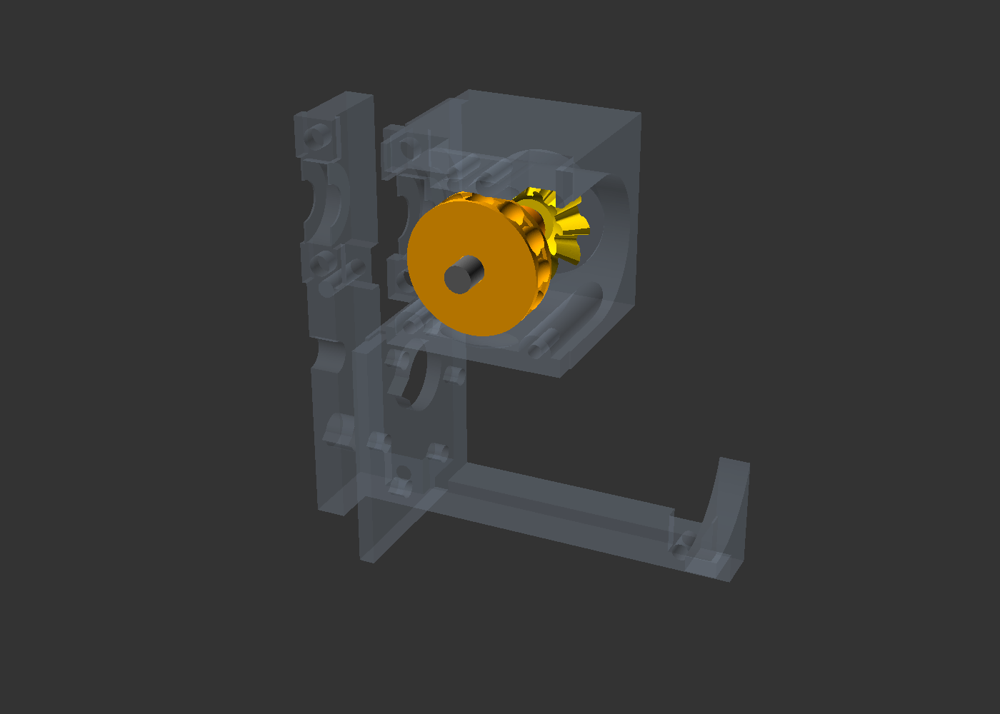
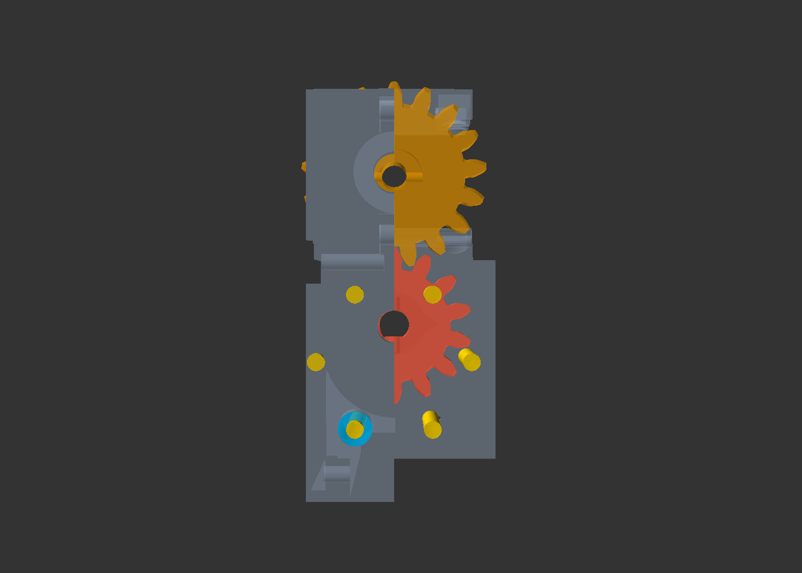
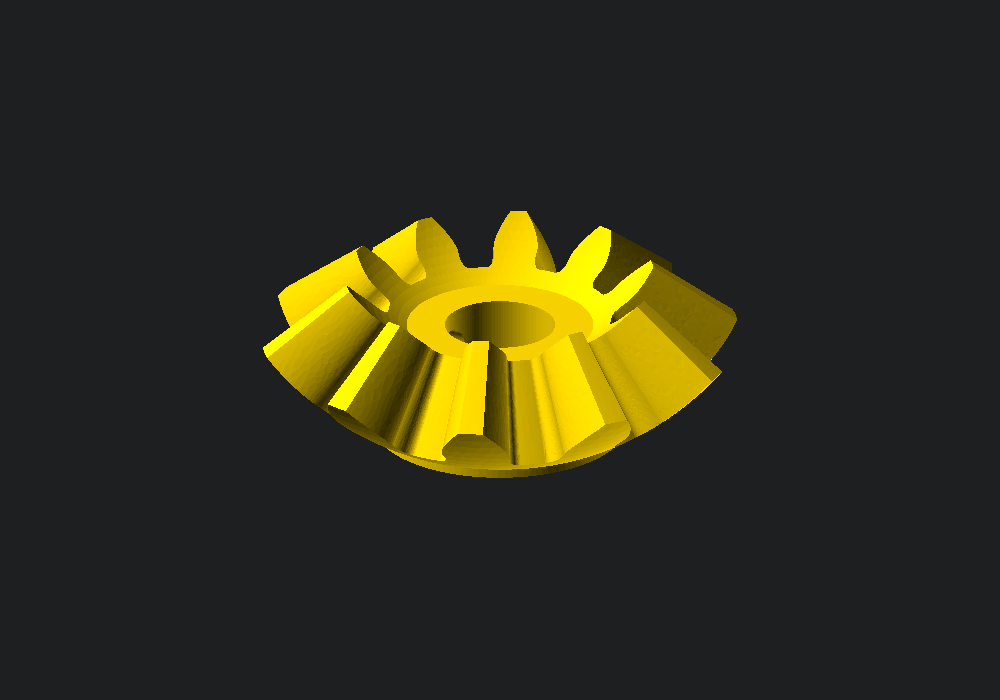
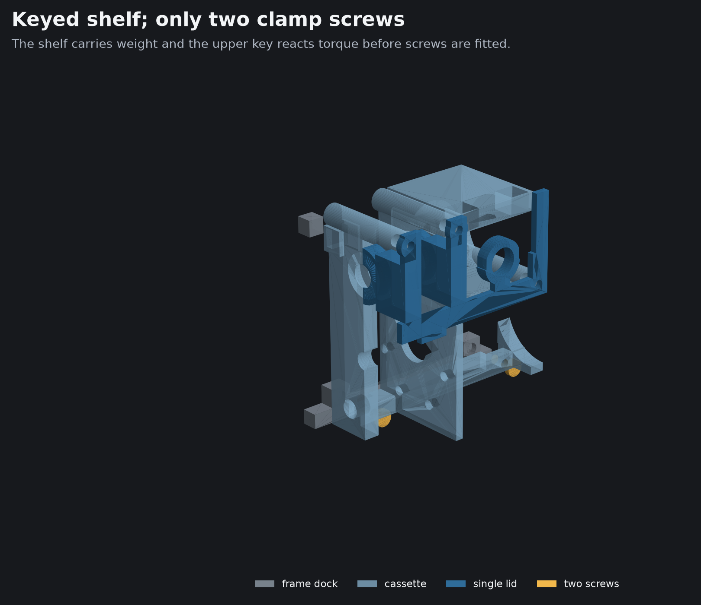

# Blinds unit v2 — center-drop chain (design)

Owner requirement change (2026-07-26): the bead chain must pass through
the **center of the unit's width**, strands separated **left/right**
(chain plane parallel to the wall), not off to the right edge with
strands front/back as in v1 (#21). Bead chain tolerates the 90° twist
over the drop to the blind's chain wheel.

## Consequences

- Sprocket axis must point **out of the wall** (unit +Y). The JGB37
  motor is 82mm along its shaft — cannot be coaxial in 44mm of depth.
  A 90° drive is required.
- Chain corridor sits at x = 49 ± 11.5 in the top ~35mm of the unit
  only (chain enters the two top slots and wraps **under** the
  sprocket) — interior below stays free.

## Decisions

**Geometry check killed the vertical-motor layout that was approved
verbally:** with the shaft vertical at (49, 21), the shaft tip crosses
the sprocket's Y-axis axle plane, and no rotating hub can bridge the
sprocket's back and front past a static shaft that intersects its own
axis. The corrected layout keeps every approved property (chain
centered, strands left/right, 98 × 44, printed gears with steel
fallback) with the motor horizontal:

- **Layout (tower), 98 × 44 × 242:**
  - PCB flat on the floor (z 6..7.6), components up, on 3× M3 bosses
    plus one plain support pillar under the USB edge.
  - Two owned Bistook three-cell holders rotate across the unit and stack
    vertically (83.00 × 133.18 mm plus a 3 mm gap, z = 17..153.18).
    Their six centred 4.2 mm holes screw directly to an integral frame
    spine; there is no battery carrier PCB.
  - Motor horizontal along X near the top: gearbox face x=67, shaft
    +X, shaft axis (y 21, z 189), eccentric DOWN (gearbox axis z 182,
    can z 163.5..200.5).
  - Sprocket axis along Y at (x 49, z 220); chain slots in the top
    face at x = 49 ± 11.5, y ≈ 36.
- **Drive: two printed stages.** Spur pair m2 14:17 (motor pinion on
  the D-shaft at x≈81.5 → layshaft at (21, 220), center distance 31).
  The layshaft is a bought Ø5×38.5 mm steel rod in two 625ZZ bearings.
  Separate face-down z17 spur and heel-down z10 bevel prints are locked
  to it with Ø2 cross pins and located by three printed axial spacers.
  The bevel meshes a separate rear-disc-down z10 bevel ring. That gear and a
  separately face-down 12-pocket chain wheel are cross-pinned to a bought
  Ø5×40 mm steel shaft, separated by a printed tube, and run in two MR105ZZ
  bearings. There is no tall printed drum bridge and the wheel is clear of
  the layshaft gear envelope. Net:
  111rpm × 14/17 ≈ 91rpm →
  ~109mm/s chain (target 100); sprocket torque ≈ 0.6 × 17/14 × ~0.72
  gear efficiency ≈ 0.52Nm vs 0.39 needed. Steel bevel fallback still
  possible (bores stay standard).
  Overall motor-to-chain-wheel reduction is 17:14, or 1.214:1: the 14:17
  spur stage reduces speed and the 10:10 bevel stage is 1:1.
- **Drive cassette (simplified 2026-08-04):** one stepped chassis owns the
  x=67..70 motor face (6×M3 BCD31), tail cradle, sprocket housing, and rear
  halves of both open 625ZZ seats. One structural room-side lid replaces the
  former two bearing caps and separate axle keeper. Two continuous full-height
  ribs embed 3 mm into both 625ZZ shells for a broad load path, then have the
  bearing and shaft envelopes re-cut; its center boss retains the front MR105ZZ.
  Three lid screws form a non-rocking triangular clamp pattern into back-rooted
  heat-set columns. A local 2.4 mm-deep apron extends only below the z17 spur,
  covering its lower tooth envelope with 0.4 mm radial allowance and 0.53 mm
  axial running clearance. The proven 14:17 ratio and 31 mm shaft spacing stay
  unchanged. The complete 89.2 × 41.0 × 81.0 mm
  pod drops onto a frame shelf, engages one upper anti-torque key, and is
  clamped by only two lower screws. The shelf/key carry shear and torque; the
  screws do not.
- **Battery loom:** the two bought holders are wired as 1S3P banks and
  series-linked for 2S3P. PACK+, midpoint, and PACK- go directly to the
  main board's three-pin battery input. No carrier PCB is required.
- **Main PCB rev C:** 88×32 lying flat. Buttons = the
  right-angle tactile the BOM already lists (C2837543), front edge,
  plungers through the front wall at z≈11.2. USB-C right-angle exits the
  front face beside them. Schematic, placement, and A* routing are complete.
- **Enclosure (revised 2026-08-04):** a wall-mounted structural
  exoskeleton owns the keyed drive shelf, two lower cassette insert pads, the
  direct battery-holder spine, PCB tray, and four #8 wall anchors. The
  removable two-print pod owns the motor, gears, every bearing seat, and
  sprocket housing. Rear load spines tie the drive region into the middle
  cross rail; battery bosses grow from visible
  side-rail brackets clear of the wall anchors, and all sleeve guides
  have positive overlap into their supporting rails. A
  separate 0.8 mm open-back, open-top sleeve slides over it and is held
  by two underside M3 screws. Rear and front top-cap halves meet at the
  chain plane, closing around both installed strands without threading. Only
  the button and USB openings remain in the sleeve front face; the shaft and
  structural cassette lid stop behind it.
  The French cleat and monolithic structural shell are removed.

### Fastener holes

| Location | Printed hole | Hardware intent |
|---|---:|---|
| Four frame-to-wall anchors | Ø4.5 mm | Plain clearance for #8 wall screws |
| Two frame cassette pads | Ø4.6 × 4.5 mm deep | M3 heat-set inserts; shelf/key carry the load |
| Six frame battery-holder bosses | Ø4.6 × 4.5 mm deep | M3 heat-set inserts; holder holes are Ø4.2 clearance |
| Three cassette lid columns | Ø4.2 × 4.8 mm deep | M3 heat-set inserts in Ø8 back-rooted columns |

## Drive assembly and service order

1. Deburr the Ø5×38.5 mm rod. Slide on the heel-down bevel, use its
   Ø2.2 guide to cross-drill the steel rod Ø2, and install a Ø2×14 mm pin.
   Then install the bevel spacer, left 625ZZ, inner spacer, z17 spur,
   outer spacer, and right 625ZZ in that order. Cross-drill the spur and
   rod together and install its Ø2×12 mm pin.
2. Before fitting the motor, place the motor spacer and loose pinion in the
   cassette cavity. Insert the motor shaft from the left through the motor
   face, spacer, and pinion. The six cassette bores are loose-FDM Ø3.5 mm M3
   clearance, but the installed gears obscure part of the BCD31 pattern. Use
   the directly reachable screws plus the lower-rear screw reached through the
   single Ø7 circular tool opening in the right support; three fasteners are
   sufficient for this mount. Then drill/tap the pinion pilot M3 and tighten
   the grub screw onto the D-flat.
3. Drop the preassembled rod stack into the two open rear bearing seats. Both
   chassis/lid halves share the same Ø16.2 × 5.2 mm clearance seat for each
   625ZZ. No shaft is threaded through a closed printed hole.
4. For the sprocket shaft, slide the rear MR105ZZ onto the Ø5×40 mm rod first.
   Add the separate bevel, cross-drill through its Ø2.2 guide, and install its
   Ø2×14 mm pin. Add the printed spacer, then the separate chain wheel and its
   Ø2×14 mm pin. Seat the rear bearing in the cassette, press the front MR105ZZ
   into the lid from behind. Bring the single lid straight onto the chassis:
   its two rearward spines close the layshaft seats and its center boss captures
   the front sprocket bearing. Fasten three M3 screws through true Ø3.4 holes
   into Ø4.2 × 4.8 mm heat-set pockets in three explicit Ø8 columns rooted at
   the chassis back face. The motor/gear/sprocket pod is now self-contained.
5. Lower the pod onto the frame shelf, engage the upper rear key, and fasten
   only the two lower M3 screws into frame heat-set inserts. Refit the chain,
   then install the sleeve and split top cap. For service, remove the
   sleeve/cap and lift off the chain, remove two dock screws, and withdraw the
   complete closed pod straight roomward. A swept-clearance regression checks
   the chassis, lid, and sprocket hardware against the bare frame throughout
   that path.

## Assembly visuals

Tight two-print pod: light blue = stepped chassis, dark blue = single
structural lid, orange/gold = gears and sprocket, silver = bought hardware:

The lid pulls straight roomward as one part, exposing both 625ZZ split seats
and the front MR105ZZ while the complete drivetrain remains in the chassis:

Split sprocket stack: layshaft bevel, sprocket bevel, spacer, chain wheel,
two MR105ZZ bearings, and the separate 5 mm steel shaft:

The sprocket spacer spans the complete bevel-to-wheel interval with only
0.1 mm axial clearance at each mating face:

Motor screw access: gold = six Ø3.5 mm M3 axes, blue = the single Ø7 circular
driver opening through the lower right-support obstruction. Gear-covered axes
remain visible here to explain why they are not service fasteners:

The sprocket bevel's 1.2 mm backing disc is hidden inside the tooth roots;
the Ø2.2 cross-pin guide exits through only the central hub:

Frame attachment: the continuous lower shelf and upper key locate the pod;
the two lower M3 screws only clamp it to those datum surfaces:

## Rejected

- Widen to ~130 for direct drive — breaks the ≤100 width rule.
- Worm drive — kills the ~30s travel target.
- Chain-redirect idlers — friction + 90° twist forced in ~50mm.
- Vertical motor + bevel — shaft tip intersects the sprocket axle
  plane; every bridge topology (drum over the shaft, crown+spur,
  wheel-beside-ring) collides with the pinion, gearbox, or rear frame.
- Single-bevel off the motor shaft directly — the motor is 82mm along
  its axis, so its shaft tip can never reach x≈49 inside 98mm.

## Risks / verify on arrival

- Printed bevel wear under 0.4Nm — the separate gear can be reprinted or
  replaced without replacing its steel rod, bearings, cassette, or frame.
- Shaft flat length (pinion rides the shaft tip) — caliper on arrival.
- Button feel through the 0.8 mm sleeve at the z≈11.2 axis — verify on
  the first physical print.

## Execution order

params/frames rewrite → part modules (pinion, sprocket+ring, keyed frame,
two-print cassette pod, sleeve, split top cap) → fit-proof `blinds-unit` scene
+ zero-interference checks → regen goldens/exports → PCB rev C
re-place/re-route + DRC → tickets #21/#22 + BOM note.
